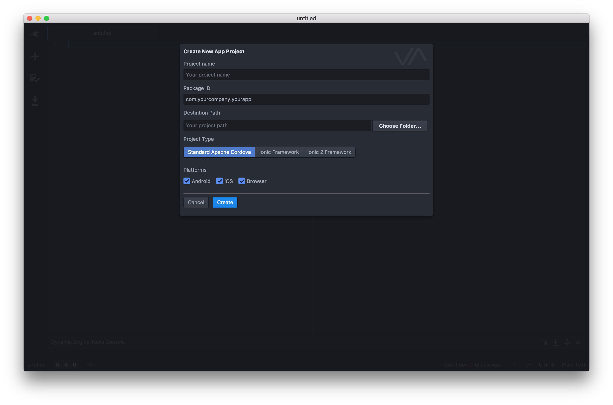
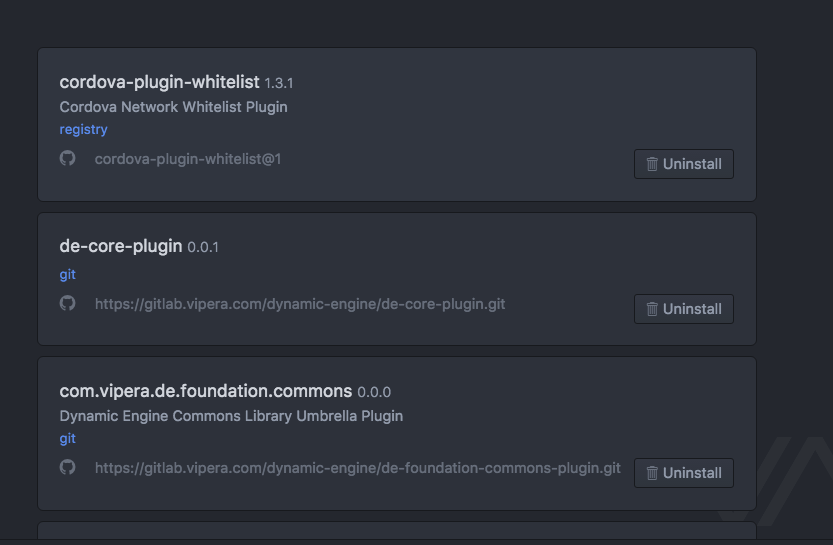
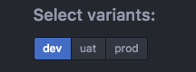
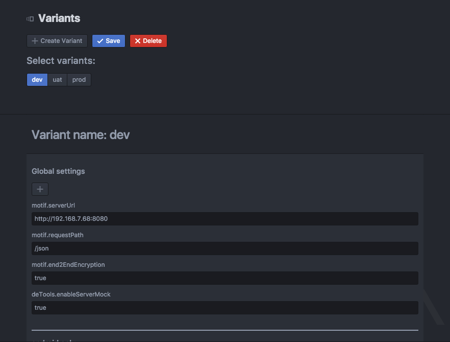
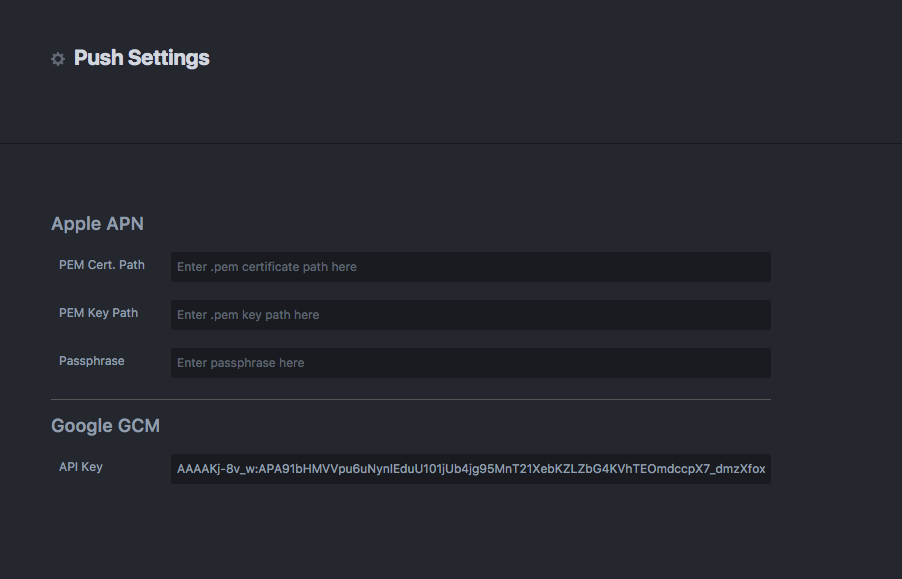
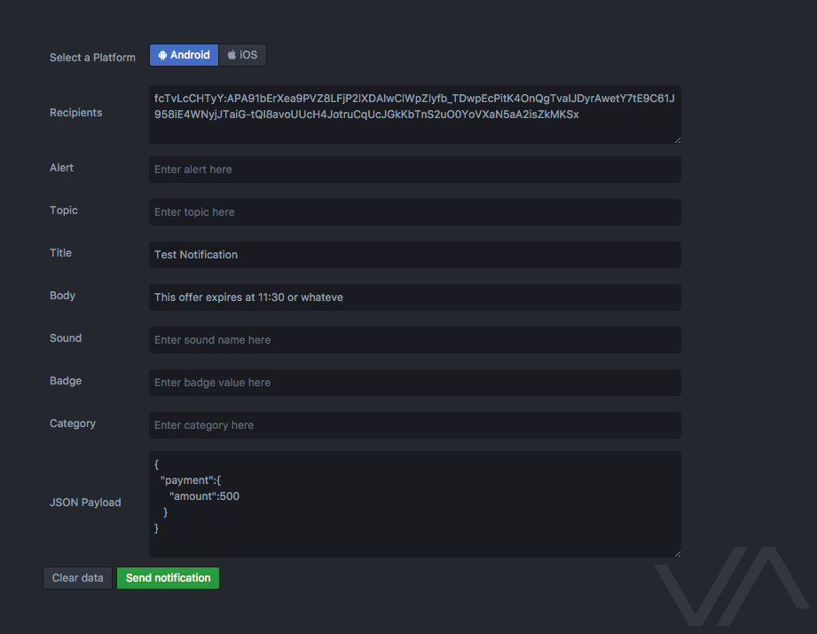
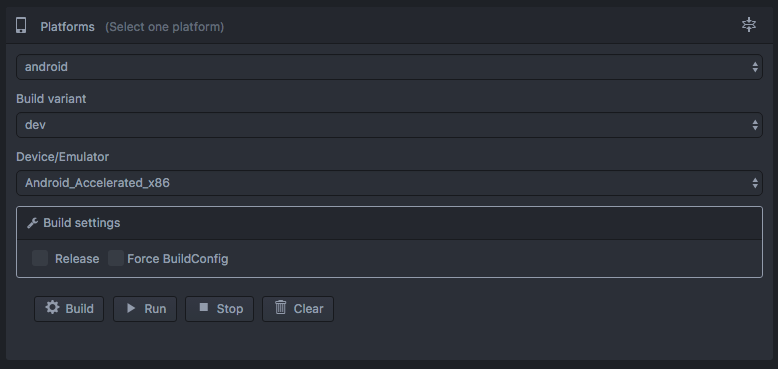
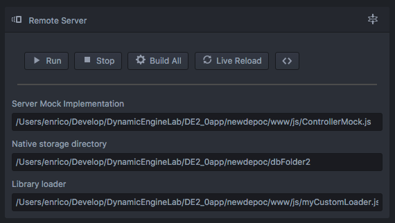
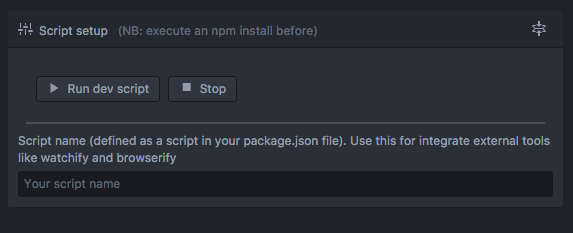

# dynamicengine-tools package

The official Dynamic Engine Tools plugin for Atom.

## Project management

### Creating a new Project
 To create a new project you can use the "Create New Project..." feature on the plugin menu.
 Here you can see the options available for creating a new Cordova project:
 


### Installed plugin
 In this view you can see all installed plugin with version and relative link to github/gitlab repo. For uninstall a plugin, click to uninstall button.
 

 > N.B: cordova-plugin-whitelist are a core security plugin installed by default (don't uninstall this).

### Install new plugin
 Provide a search in Cordova plugins Registry (https://cordova.apache.org/plugins/)
 filterable by Platforms. Every result record contains version, last update date and a button install for fast download and install


### Dynamic Engine Plugins
 Official Dynamic Engine plugins section. For download and install a plugin, verify your git account (required for gitlab access)
### Variants
 > Cordova doesn't provide an explicit variant support, but provide a flexible build system customizable with hook (https://cordova.apache.org/docs/en/latest/guide/appdev/hooks/).
 For install variants support in your project, link variants_after_prepare.js and variants_before_prepare.js hooks in your config.xml (see de-core-plugin doc)

For create new variants, click to create new variant, insert your variant name and save it.
Now your variant could be appear in variant selector:

 

For every variant you can add preference (name-value pair) for every platform (Global section) or platform specific (Android, iOS or Browser)



> NB: save changes before switch to other views

You can also modify variants definition manually (open and edit ./variants/variants_def.xml file)
```
<?xml version="1.0" encoding="UTF-8" standalone="yes"?>
<variants>

  <!-- define variant dev -->
  <variant name="dev">
    <!-- global preferences for dev-->
    <preference name="motif.serverUrl" value="http://192.168.7.68:8080"/>
    <preference name="motif.requestPath" value="/json"/>
    <preference name="motif.end2EndEncryption" value="true"/>
    <preference name="deTools.enableServerMock" value="true"/>
    <!-- platform-specific preferences for dev -->
    <platform name="android">
      <preference name="deTools.debuggerUrl" value="http://192.168.1.2:3000"/>
      <preference name="deTools.enableServerMock" value="true"/>
    </platform>
    <platform name="ios">
      <preference name="deTools.debuggerUrl" value="http://192.168.1.2:3001"/>
    </platform>
    <platform name="browser">
      <preference name="deTools.debuggerUrl" value="http://192.168.1.2:3001"/>
      <preference name="motif.end2EndEncryption" value="fale"/>
    </platform>
  </variant>

  <!-- define variant uat -->
  <variant name="uat">
    <platform name="android"/>
    <platform name="ios"/>
    <platform name="browser"/>
  </variant>

  <!-- define variant prod -->
  <variant name="prod">
    <platform name="android"/>
    <platform name="ios"/>
    <platform name="browser"/>
  </variant>
</variants>
```

## Push Tool
Development purpose only tools for send push notification to Android and iOS platform
### Configuration

APN configuration require PEM certificate, PEM key and Passphase.

See https://gitlab.vipera.com/dynamic-engine/de-plugins/wikis/how-to-setup-apple-apn-certificates-for-ios-push-notifications for more information

### Send a push
After configuration, use send push view for create and send your push notification



## Run Configuration
Open a right panel with Build/Run configuration, integration with remove server (live-reload, remote assets and browser emulation) and npm script integration.

### Platforms Section
With this collapsable section you can build and run your application in your device/emulator




For execute a build , choose a platform in the firs select and click to build (with the second selector your build variant). For build in release, select Release under Build settings sub section. (see https://cordova.apache.org/docs/en/latest/reference/cordova-cli/#cordova-build-command for more information about use of build.json as a buildConfig)
After build success you can run app in a device/emulator.


### Remote server section
If your app use de-tools-plugin, you can connect this with atom plugin and use live-reload feature (Atom plugin provide your app assets remotely).



In this panel you can set your mock implementation (for browser emulation), a folder where save NativeStorage of your mock save data (with a custom and reusable format) and a libraryLoader js (see **How to define library Loader** section for more details),

#### How to define library loader
 de-tools-plugin support mock implementation of Dynamic Engine communication based on js file named (for convention) ControllerMock. In this file you can implement your mock logic using all platform api and imported js library. For example, after NativeStorage plugin installation, you can use this for save and load data in your mock. However, when you use atom remote server (for example for browser emulation), your mock implementation run in a node server. How to provide same api/js-library when mock is running in atom? Set a library loader module implementation.
 Library loader is a js module that allow you to load custom js (like a script in your index) and redifine clobber that is normally provided by your platform plugins.

```
    module.exports = function(reload,serviceBridge){
       /* use reload to require js file or npm modules
        * and use serviceBridge for access to service
        * such as persistenceService (aka NativeStorage) or
        * DEStorage (like localStorage)
        */
    }
```


### Script Tool


